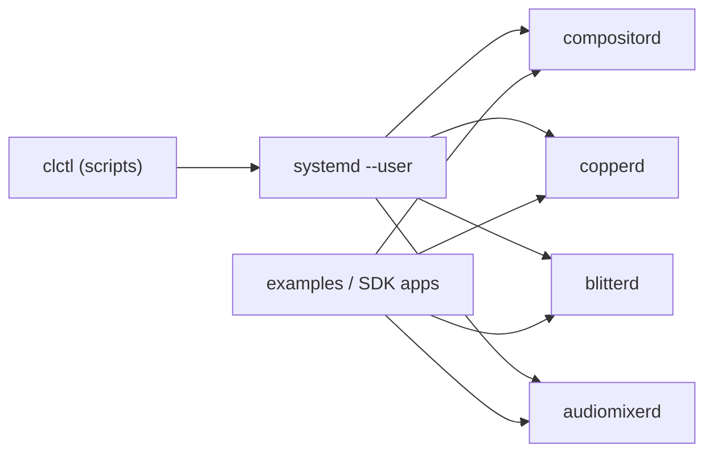

# host-linux

**CopperlineOS on a Linux host (Phase‑0 runtime & dev harness).**  
This repo bundles scripts, configs, and service wiring to **run the CopperlineOS stack on a normal Linux distro**—no kernel patches required. It’s the fastest way to boot `compositord`, `copperd`, `blitterd`, and `audiomixerd`, wire them together, and run the examples.

> TL;DR: `clctl up` to start everything, `clctl doctor` to verify GPU/audio access, and `clctl logs` to watch the stack.

---

## What’s inside

```
host-linux/
├─ scripts/
│  ├─ clctl                 # stack manager: up/down/status/logs/doctor
│  ├─ doctor.sh             # permission & device checks
│  ├─ env.sh                # common env vars for services
│  └─ build.sh              # convenience builder (debug/release)
├─ configs/                 # default service configs (toml/json)
│  ├─ compositord.toml
│  ├─ copperd.toml
│  ├─ blitterd.toml
│  └─ audiomixerd.toml
├─ profiles/                # ready-to-use runtime profiles
│  ├─ kms.env               # run compositord on DRM/KMS
│  ├─ wayland.env           # host under Wayland
│  └─ x11.env               # host under X11
├─ systemd-user/            # user-session units (preferred for dev)
│  ├─ compositord.service
│  ├─ copperd.service
│  ├─ blitterd.service
│  ├─ audiomixerd.service
│  └─ copperline.target
├─ docker/                  # optional container dev (podman/docker-compose)
│  ├─ docker-compose.yml
│  └─ README.md
└─ README.md                # you are here
```

- **User‑session `systemd` units** let you run everything without root.  
- **Profiles** flip between **KMS**, **Wayland**, and **X11 host mode** by exporting a few env vars.  
- **Scripts** provide a one‑command dev loop and a **doctor** to catch common pitfalls.

---

## Big picture



<details>
<summary>Text-only fallback</summary>

```
clctl -> systemd --user -> { compositord, copperd, blitterd, audiomixerd } <- apps/examples
```
</details>

---

## Prerequisites

- A recent Linux distro (Debian 12/Ubuntu 24.04/Fedora 40+ recommended).  
- GPU with Vulkan driver (or use Wayland/X11 host mode).  
- Access to **DRM** render nodes (for GPU compute) and **ALSA** (for audio).  
- Rust toolchain (for building from source): `rustup default stable`.

Optional but recommended:
- **seatd** **or** logind for KMS seat management.  
- `jq` for JSON snippets in CLI examples.

---

## Quick start (user‑session units)

```bash
git clone https://github.com/CopperlineOS/host-linux
cd host-linux

# 0) Build the daemons (or install packages from 'packaging')
./scripts/build.sh --release  # builds compositord/copperd/blitterd/audiomixerd from sibling repos if present

# 1) Install user services
systemctl --user enable --now ./systemd-user/copperline.target

# 2) Pick a profile (KMS | Wayland | X11) and export env
source profiles/kms.env      # or wayland.env / x11.env

# 3) Start the stack
./scripts/clctl up

# 4) Verify
./scripts/clctl doctor
./scripts/clctl status
```

Now try an example (from the [`examples`](https://github.com/CopperlineOS/examples) repo):

```bash
# Create a layer and bind a test sprite (debug path binding)
portctl /run/copperline/compositord.sock '{"cmd":"create_layer"}'
portctl /run/copperline/compositord.sock   '{"cmd":"bind_image","id":1,"path":"/tmp/sprite.rgba","w":128,"h":128,"format":"RGBA8"}'
```

---

## Run modes

### 1) **KMS** (own the display; most deterministic)

- `COMPOSITORD_BACKEND=kms` (default in `profiles/kms.env`)  
- Run from a TTY (no desktop) or as a dedicated seat.  
- Requires KMS permissions (seatd/logind).

### 2) **Wayland/X11 host mode** (inside your desktop session)

- `COMPOSITORD_BACKEND=wayland` or `x11`  
- `compositord` renders to a host window; still exposes layers/regs.  
- Great for laptops and dev sessions; slightly higher latency.

Switch profiles by `source profiles/<name>.env` before `clctl up`.

---

## `clctl` cheatsheet

```
clctl up                # start all services
clctl down              # stop all services
clctl restart <svc>     # restart one (compositord|copperd|blitterd|audiomixerd)
clctl status            # systemctl --user status summary
clctl logs <svc>        # follow logs for a service
clctl doctor            # GPU/audio/permissions & env checks
```

Under the hood `clctl` calls `systemctl --user` with the right environment and prints helpful hints.

---

## Environment variables

Most services read settings from env (see each repo for details). Common ones:

- `COMPOSITORD_SOCKET=/run/copperline/compositord.sock`  
- `COMPOSITORD_BACKEND=kms|wayland|x11`  
- `COMPOSITORD_OUTPUT=auto|HDMI-A-1`  
- `COMPOSITORD_MODE=1920x1080@60`  
- `COPPERD_SOCKET=/run/copperline/copperd.sock`  
- `BLITTERD_SOCKET=/run/copperline/blitterd.sock`  
- `AUDIOMIXERD_SOCKET=/run/copperline/audiomixerd.sock`

The `scripts/env.sh` exports sensible defaults and is sourced by the user units.

---

## Logs & diagnostics

```bash
journalctl --user -u compositord -f
journalctl --user -u copperd -f
journalctl --user -u blitterd -f
journalctl --user -u audiomixerd -f
```

Doctor checks include:
- Vulkan device/driver presence and **renderD** access.  
- KMS/DRM primary access (if using `kms` backend).  
- ALSA devices + RT scheduling via **rtkit**.  
- Socket paths and permissions under `/run/copperline`.

---

## Permissions

Add your user to groups required by your distro (values vary):

```bash
sudo groupadd -f copperline
sudo usermod -aG copperline,video,audio $USER
# Re-login after changing group memberships
```

A minimal udev snippet (installed by `packaging` or copy here if needed):

```
KERNEL=="renderD*", SUBSYSTEM=="drm", GROUP="copperline", MODE="0660"
KERNEL=="midi*", SUBSYSTEM=="snd", GROUP="copperline", MODE="0660"
```

---

## Containers (optional)

A `docker-compose.yml` lets you run the services in containers for CI or experiments. GPU and audio device passthrough varies by distro; host mode (Wayland/X11) is easier inside containers than KMS.

```bash
cd docker
docker compose up -d
docker compose logs -f
```

---

## Uninstall / stop

```bash
./scripts/clctl down
systemctl --user disable --now copperline.target
```

To remove generated sockets: `sudo rm -rf /run/copperline/*` (only if services are stopped).

---

## Troubleshooting

- **Permission denied (DRM/ALSA):** ensure group membership and re-login; try Wayland/X11 mode.  
- **No vsync / tearing in host mode:** some compositors throttle; try KMS or adjust host compositor settings.  
- **Audio xruns:** increase period size in `audiomixerd` config; verify RT scheduling with rtkit.  
- **Sockets missing:** `clctl status` and `journalctl --user -u <svc>` for errors.

---

## License

Scripts and configs are dual‑licensed under **Apache‑2.0 OR MIT**.

---

## See also

- Core services: [`compositord`](https://github.com/CopperlineOS/compositord) · [`copperd`](https://github.com/CopperlineOS/copperd) · [`blitterd`](https://github.com/CopperlineOS/blitterd) · [`audiomixerd`](https://github.com/CopperlineOS/audiomixerd)  
- Tools: [`tools`](https://github.com/CopperlineOS/tools) · Examples: [`examples`](https://github.com/CopperlineOS/examples)  
- Packaging: [`packaging`](https://github.com/CopperlineOS/packaging) — system packages & units
